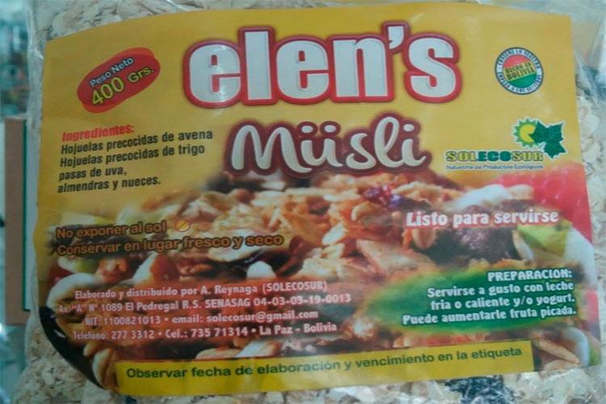
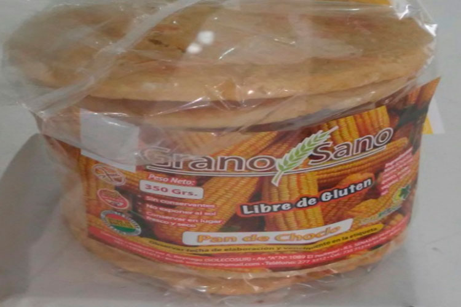

<!DOCTYPE html>

<html lang="es">

	<head>
		<meta charset="utf-8">
		<title>Solecosur Alimentos</title>
		<meta name="description" content="Responsive HTML5 Template">

		<!-- Mobile Meta -->
		<meta name="viewport" content="width=device-width, initial-scale=1.0">

		<!-- Favicon -->
		<link rel="shortcut icon" href="images/logo.png">
 
		<link href="bootstrap/css/bootstrap.css" rel="stylesheet"> 
		<link href="fonts/font-awesome/css/font-awesome.css" rel="stylesheet"> 
		<link href="css/animations.css" rel="stylesheet"> 
		<link href="css/style.css" rel="stylesheet"> 
		<link href="css/custom.css" rel="stylesheet">
	</head>

	<body class="no-trans">
		<!-- scrollToTop --> 
		
<i class="icon-up-open-big"></i>

		<!-- header start --> 
		<header class="header fixed clearfix navbar navbar-fixed-top">
			

				

					

						<!-- header-left start --> 
						

							<!-- logo -->
							

								
							

							

						

						<!-- header-left end -->

					

					

						<!-- header-right start --> 
						

							<!-- main-navigation start --> 
							

								<!-- navbar start --> 
								<nav class="navbar navbar-default" role="navigation">
									

										<!-- Toggle get grouped for better mobile display -->
										

											<button type="button" class="navbar-toggle" data-toggle="collapse" data-target="#navbar-collapse-1">
												Toggle navigation
												
												
												
											</button>
										

										<!-- Collect the nav links, forms, and other content for toggling -->
										

											<ul class="nav navbar-nav navbar-right">
												<li class="active"><a href="#banner">Inicio</a></li>
												<li><a href="#services">Nuestras Lineas</a></li>
												<li><a href="#about">Solecosur</a></li>
												
												<li><a href="#portfolio">Productos</a></li>
												<!--<li><a href="#price">Price</a></li>-->
												<li><a href="#contacto">Contactanos</a></li>
											</ul>
										

									

								</nav>
								<!-- navbar end -->

							

							<!-- main-navigation end -->

						

						<!-- header-right end -->

					

				

			

		</header>
		<!-- header end -->

		<!-- banner start --> 
		

			

			

				

					
					 
						

								<h1>Solecosur</h1>
								<h3 class="padding-top30" >Productos Ecológicos</h3>
								

							
									<button class="btn cta-button" target="_blank"  onclick="location.href='https://www.facebook.com/SoleCosur-Alimentos-436584633433291'" type="button" >Envianos un mensaje</button>
									
								

							

					

				

			

		

		<!-- banner end -->
		<section class="hero-caption secPadding">

		

	
	

				

	<h2>Bienvenido <strong>SOLECOSUR ALIMENTOS</strong> - Alimentos Ecológicos</h2>
		
SOLECOSUR, elabora productos alimenticios cuya materia prima la constituyen productos orgánicos, ecológicos y con alto valor nutricional como son, los cereales andinos (quinua, cañahua, amaranto y variedad de maíces), frutas (frutilla, mango, piña, guayaba, durazno, manzanas y otras).

 	

			

		

	
</section>
<!-- section start --> 
		<section class="section transprant-bg pclear secPadding">
			

				<h1 id="services" class="title text-center">Nuestras Lineas De Productos</h1>
				

				

					

						

							

								<i class="fa fa-trophy"></i>
							

							

								<h3 class="media-heading">Línea Panes</h3>
								<blockquote>
									
GRANO SANO – Pan de choclo (libre de gluten) Pan sueco, galletas libres de gluten.

								</blockquote>
							

						

					

					

						

							

								<i class="fa fa-trophy"></i>
							

							

								<h3 class="media-heading">Línea Pitos</h3>
								<blockquote>
									
BIOS – Pito de amaranto (libre de gluten).

									
								</blockquote>
							

						

					

					

						

							

								<i class="fa fa-trophy"></i>
							

							

								<h3 class="media-heading">Línea Cereales</h3>
								<blockquote>
									
ELLEN’S – Hojuela instantánea de quinua (libre de gluten), Hojuela instantánea de amaranto (libre de gluten),  Músli.

									
								</blockquote>
							

						

					

				

				

					

						

							

								<i class="fa fa-trophy"></i>
							

							

								<h3 class="media-heading">Línea Apis</h3>
								<blockquote>
									
Api Amarillo y Api Morado con y sin azúcar.

									
								</blockquote>
							

						

					

					

						

							

								<i class="fa fa-trophy"></i>
							

							

								<h3 class="media-heading">Línea Mermelada</h3>
								<blockquote>
									
NICO’S – Sin azúcar: Guayaba, Piña, Papaya, Higo, Mango, Manzana, Durazno, Frutilla y Lacayote.

									
								</blockquote>
							

						

					

					

						

							

								<i class="fa fa-trophy"></i>
							

							

								<h3 class="media-heading">Línea Expandidos</h3>
								<blockquote>
									
ANDREA´S – Pipocas de amaranto.

									
								</blockquote>
							

						

					

				

			
			  
		</section>
		<!-- section end -->

		<!-- section start --> 
		<section class="section clearfix no-view secPadding" data-animation-effect="fadeIn">
			

				

					

						<h1 id="about" class="title text-center">Acerca de solecosur</h1>
						
SOLECOSUR, elabora productos alimenticios cuya materia prima la constituyen productos ecológicos.

						

						

							

								
								

							

							

								
SOLECOSUR se encuentra ubicada en la Zona de El Pedregal, Avenida “A” Nº 1089. Se dedica a la elaboración de alimentos nutritivos: pan sueco, galletas de cañahua y amaranto (libre de gluten), müsli, mermeladas dietéticas (sin azúcar), pan de choclo, entre otros. La infraestructura fue diseñada para trabajar sin el uso de luz, con la ventilación adecuada y las condiciones de pisos y paredes lavables.

								
La venta de sus productos realiza a través de minoristas (tiendas ecológicas) y de forma directa en las ferias. Sus clientes frecuentes representan el 90% de sus ventas, que son 25 tiendas de La Paz, Oruro, Sucre y Cbba. Su promoción es de boca a boca, también entrega de tarjetas de presentación, Facebook y etiquetas por productos.

								
							

						

						

						<h2>La razón de ser y existir</h2>
						

							

								
Usted trabaja y SOLECOSUR se preocupa de su salud. Nuestra empresa ha desarrollado diferentes líneas saludables y nutritivas para responder las necesidades nutricionales de nuestros clientes de alto rendimiento.

									<ul class="list-unstyled">
								
									<li><i class="fa fa-arrow-circle-right pr-10 colored"></i> “Productos 100% naturales”.</li>
								
								</ul>
						
							

							

								

									

										

											<h4 class="panel-title">
												<a data-toggle="collapse" data-parent="#accordion" href="#collapseOne" aria-expanded="true" aria-controls="collapseOne">
													Visión
												</a>
											</h4>
										

										

											

												Ser reconocidos como la Industria líder en la transformación de alimentos ecológicos nacionales.
											

										

									

									

										

											<h4 class="panel-title">
												<a class="collapsed" data-toggle="collapse" data-parent="#accordion" href="#collapseTwo" aria-expanded="false" aria-controls="collapseTwo">
													Misión
												</a>
											</h4>
										

										

											

												Elaborar productos ecológicos, integrales y nutritivos; cuidando la salud de sus clientes revalorizando la producción nacional de frutas,  granos y cereales.
											

										

									

									
								

							

						

					

				

			

		</section>
		<!-- section end -->
 
		<!-- section start --> 
		

			

				

					

						<h1 class="text-center">“Su desayuno debe ser de reyes”</h1>
					

				

			

		

		<!-- section end -->

		<!-- section start --> 
		<section class="section secPadding">
			

				<h1 class="text-center title" id="portfolio">Nuestros Productos</h1>
				

				
Todos nuestros productos son elaborados con  materia prima 100% nacionales y de calidad.

				 			
				

					

						<!-- isotope filters start -->
						

							<ul class="nav nav-pills">
								<li class="active"><a href="#" data-filter="*">Todos</a></li>
								<li><a href="#" data-filter=".web-design">Desayunos</a></li>
								<!--<li><a href="#" data-filter=".app-development">App development</a></li>
								<li><a href="#" data-filter=".mobile-apps">Mobile Apps</a></li>--->
							</ul>
						

						<!-- isotope filters end -->

						<!-- portfolio items start -->
						

							

								

									

										
										<a class="overlay" data-toggle="modal" data-target="#project-1">
											<i class="fa fa-search-plus"></i>
											 
										</a>
									

									<a class="btn btn-default btn-block" data-toggle="modal" data-target="#project-1">Api Morado y Amarillo</a>
								

								<!-- Modal -->
								

									

										

											

												<button type="button" class="close" data-dismiss="modal">&times;Cerrar</button>
												<h4 class="modal-title" id="project-1-label">Api Morado y Amarillo</h4>
											

											

												
												
												 
													

														
 

														 
														<h3>Descripcion</h3>
														
Producto a base de maíz morado (maíz kulli) o amarillo molido, mezclado con canela, clavo de olor, con o sin azúcar y limón. Los cuidados y calidad de procesamiento abarcan desde el desgranado de la mazorca de maíz, su seleccionado, molido y envasado. 
															Este sabroso api requiere una cocción de 15 minutos. Si gusta puede adicionarle gotas de limón.
															Puede servirse acompañado de buñuelos o pan. Un alimento caliente y nutritivo especialmente en invierno.
															

															

																PROPIEDADES: Energizante, alimento ideal para deportistas, metaboliza grasas y estreñimiento y reduce el    colesterol alto, combate el frío nutritivo y saciante. 
															

													

												

											

											

												<button type="button" class="btn btn-sm btn-default" data-dismiss="modal">Cerrar</button>
											

										

									

								

								<!-- Modal end -->
							

							

								

									

										
										<a class="overlay" data-toggle="modal" data-target="#project-2">
											<i class="fa fa-search-plus"></i>
											 
										</a>
									

									<a class="btn btn-default btn-block" data-toggle="modal" data-target="#project-2">MÜSLI</a>
								

								<!-- Modal -->
								

									

										

											

												<button type="button" class="close" data-dismiss="modal">&times;Cerrar</button>
												<h4 class="modal-title" id="project-2-label">MÜSLI</h4>
											

											

												
												
												 
													

														

														 
														<h3>Descripcion</h3>
														
Combinación balanceada altamente nutritiva con alto contenido de de fibra soluble e insoluble, sin azúcar, contiene (avena laminada precocida, almendra, nueces y pasas de uva. 
															Este nutritivo producto es una adaptación del müsli alemán que como en su país de origen (Suiza) no debe faltar en la alacena boliviana.  Su calidad está garantizada por los ingredientes cuidadosamente seleccionados. 
															Para servirse adicionarle leche caliente o fría, y/o yogurt, puede acompañar de frutas picadas como ser manzana o papaya y plátano. Para endulzarlo mejor si usar 1 cuchara de miel.  Servido de esta forma sustituye de forma excelente al desayuno tradicional de pan y té o café.
															Sustituto de cualquier cereal no natural.
															

															
PROPIEDADES: Combate la anemia, desayuno más apropiado y regulador digestivo.

													

												

											

											

												<button type="button" class="btn btn-sm btn-default" data-dismiss="modal">Cerrar</button>
											

										

									

								

								<!-- Modal end -->
							

							
							

								

									

										
										<a class="overlay" data-toggle="modal" data-target="#project-3">
											<i class="fa fa-search-plus"></i> 
										</a>
									

									<a class="btn btn-default btn-block" data-toggle="modal" data-target="#project-3">Pan Sueco</a>
								

								<!-- Modal -->
								

									

										

											

												<button type="button" class="close" data-dismiss="modal">&times;Cerrar</button>
												<h4 class="modal-title" id="project-3-label">Pan Sueco</h4>
											

											

												
												
												 
													

														
 

														 
														<h3>Descripcion</h3>
														
Es una clase de pan laminado. Producto estrella a base de harina integral de trigo, sal yodada, aceite vegetal, con linaza o sésamo. 
															Para garantizar su calidad contactamos, seleccionado trigo desde su cosecha ecológica, su lavado, su escogido y, finalmente, su molienda, preparado y horneado. 
															Puede servirse como pan untado con miel, crema de leche, queso fundido y/o  cualquier clase de mermelada. Puede servirle también solo como “snack”.
															

															

																PROPIEDADES: Pan sueco de linaza: Dietético, regulador digestivo, nutritivo y sano, Pan sueco de sésamo o ajonjolí: Dietético, fuente de calcio, nutritivo y sano. 

															

													

												

											

											

												<button type="button" class="btn btn-sm btn-default" data-dismiss="modal">Cerrar</button>
											

										

									

								

								<!-- Modal end -->
							

							
							

								

									

										
										<a class="overlay" data-toggle="modal" data-target="#project-4">
											<i class="fa fa-search-plus"></i> 
										</a>
									

									<a class="btn btn-default btn-block" data-toggle="modal" data-target="#project-4">Pan De Choclo (Libre De Gluten)
							
										</a>
								

								<!-- Modal -->
								

									

										

											

												<button type="button" class="close" data-dismiss="modal">&times;Cerrar</button>
												<h4 class="modal-title" id="project-4-label">Pan De Choclo (Libre De Gluten)</h4>
											

											

												
												
												 
													

														

														 
														<h3>Descripcion</h3>
														
Productos alternativo al pan del día. Es una adaptación del pan de choclo tradicional de los campos chuquisaqueños. Producto a base de choclo fresco, harina de arroz, sal yodada, aceite vegetal, con ralladura de queso.
															Garantizamos su calidad con la selección del mejor choclo nacional.
															Puede servirse como pan untado con miel o  cualquier clase de mermelada. Puede servirle también solo como “snack”.  Es el único producto salado de nuestra elaboración.
															

															

																PROPIEDADES: Libre de gluten, energizante, alimento ideal para deportistas, energizante, metaboliza grasas y estreñimiento y reduce el    colesterol alto, combate el frío nutritivo y saciante.
															

													

												

											

											

												<button type="button" class="btn btn-sm btn-default" data-dismiss="modal">Cerrar</button>
											

										

									

								

								<!-- Modal end -->
							

							
							

								

									

										
										<a class="overlay" data-toggle="modal" data-target="#project-5">
											<i class="fa fa-search-plus"></i> 
										</a>
									

									<a class="btn btn-default btn-block" data-toggle="modal" data-target="#project-5">Mermeladas</a>
								

								<!-- Modal -->
								

									

										

											

												<button type="button" class="close" data-dismiss="modal">&times;Cerrar</button>
												<h4 class="modal-title" id="project-5-label">Mermeladas</h4>
											

											

												
												
												 
													

														

														 
														<h3>Bescripcion</h3>
														

															Son con frutas 100 % nacionales y de producción temporaria. Sin azúcar; libres de pectina, de ácido cítrico. Con procesos  térmicos cortos garantizamos su  conservación: del sabor, olor y color de la fruta; es envasado al vacío. 
La selección de la fruta se realiza desde el lugar de cosecha; campos ecológicamente garantizados y controlados.
Las tenemos de guayaba, frutilla, piña, mango, durazno, higo, papaya, manzana, yacon (aricoma).

														

														

															PROPIEDADES: Fuente de energízante natural.
															 
															SUGERENCIA IMPORTANTES: 
															 	
															-	La mermelada de guayaba se puede mezclar con mayonesa para acompañar la fondue de carne o queso. 
															 
															-	Al consumir mermeladas, evite endulzar su bebida caliente; esto para balancear la ingesta de dulce en el cuerpo.
															 
															-	En lugar de consumir yogur no muy sano, utilice mermeladas Nico’s para saborizar un yogur naturales, asi tendrá un yogur de sabor natural,  libre de quimicos y poca azúcar
															
														
	
													

												

											

											

												<button type="button" class="btn btn-sm btn-default" data-dismiss="modal">Cerrar</button>
											

										

									

								

								<!-- Modal end -->
							

							
							

								

									

										
										<a class="overlay" data-toggle="modal" data-target="#project-6">
											<i class="fa fa-search-plus"></i> 
										</a>
									

									<a class="btn btn-default btn-block" data-toggle="modal" data-target="#project-6">Miel</a>
								

								<!-- Modal -->
								

									

										

											

												<button type="button" class="close" data-dismiss="modal">&times;Cerrar</button>
												<h4 class="modal-title" id="project-6-label">Miel</h4>
											

											

												
												
												 
													

														

														 
														<h3>Descripcion</h3>
														
Acopiado del sur de Chuquisaca de colmenas naturales de abejas de campos con poco contacto humano. Garantizamos así su alta calidad y pureza. Ideal para endulzar sus bebidas  o untar su pan.

														
PROPIEDADES: Energizante natural y antioxidante

													

												

											

											

												<button type="button" class="btn btn-sm btn-default" data-dismiss="modal">Cerrar</button>
											

										

									

								

								<!-- Modal end -->
							

							
							

								

									

										
										<a class="overlay" data-toggle="modal" data-target="#project-7">
											<i class="fa fa-search-plus"></i>
											Sitio construyendo
										</a>
									

									<a class="btn btn-default btn-block" data-toggle="modal" data-target="#project-7">Pito De Amaranto</a>
								

								<!-- Modal -->
								

									

										

											

												<button type="button" class="close" data-dismiss="modal">&times;Cerrar</button>
												<h4 class="modal-title" id="project-7-label">Pito De Amaranto</h4>
											

											

												
												
												 
													

														

														 
														<h3>Descripcion</h3>
														
Producto del grano más diminuto que la quinua.  Su cosecha implica mucha dedicación y cuidado. Su extremo cuidado hasta el escogido y el molido recompensan enormemente el altísimo valor nutritivo. 
															Puede licuar con leche y miel para servirse como un nutritivo jugo. Puede mezclarlo solamente con agua para un refrescante refresco, también esv sustituto del café o té caliente o finalmente puede añadirlo a su sopa (1 cuchara) para voverla más nutritiva.
															

															

																PROPIEDADES: Osteoporosis, cáncer de colón, hipertensión arterial, estreñimiento, e insuficiencia renal crónica.
															

													

												

											

											

												<button type="button" class="btn btn-sm btn-default" data-dismiss="modal">Cerrar</button>
											

										

									

								

								<!-- Modal end -->
							

							
							
							

								

									

										
										<a class="overlay" data-toggle="modal" data-target="#project-8">
											<i class="fa fa-search-plus"></i> 
										</a>
									

									<a class="btn btn-default btn-block" data-toggle="modal" data-target="#project-8">Quinua Instantanea</a>
								

								<!-- Modal -->
								

									

										

											

												<button type="button" class="close" data-dismiss="modal">&times;Cerrar</button>
												<h4 class="modal-title" id="project-8-label">Quinua Instantanea</h4>
											

											

												
												
												 
													

														

														 
														<h3>Descripcion</h3>
														
Producto Instantáneo de quinua y amaranto laminado (hojuelada) listo para consumir con yogurt, leche fría o caliente acompañado de frutas.
															La selección de la materia prima se realiza desde la desde la cosecha, lavado y tostado. Es altamente nutritivo.
															

															

																PROPIEDADES: Superalimento, alimento para deportistas, poder saciante, colesterol, dietas de adelgazamiento.
															

													

												

											

											

												<button type="button" class="btn btn-sm btn-default" data-dismiss="modal">Cerrar</button>
											

										

									

								

								<!-- Modal end -->
							

							

						

						<!-- portfolio items end -->
					
					

				

			

		</section>
		<!-- section end -->
<!-- section start --> 

		<section class="default-bg secPadding">
		

  

    

    <h2>Nuestros productos se encuentran en:</h2>
    

  

  

    

      

       
        <ol class="carousel-indicators">
          <li data-target="#quote-carousel" data-slide-to="0" class="active"></li>
          <li data-target="#quote-carousel" data-slide-to="1"></li>
		  <li data-target="#quote-carousel" data-slide-to="2"></li>
		  <li data-target="#quote-carousel" data-slide-to="3"></li>
        </ol>
        
     
        

        
          
          

            <blockquote>
              

                

                  
                

                

                  
Av. Simón Bolívar Nº8 (ex-pasarela estadio), Zona Miraflores.

                  <small style="color: #ffffff;">TIENDA PURA VIDA SANA ECOLÓGICA NATURAL</small>
                

              

            </blockquote>
          

         
          

            <blockquote>
              

                

                  
                

                

                  
Av. Mariscal Santa Cruz Ed. Dante Nº1350 Lado Femenina (ingresando al fondo), Zona Central.
					

                  <small style="color: #ffffff;">CAFÉ RESTAURANT - LURATHAPI</small>
                

              

            </blockquote>
		  

		  

            <blockquote>
              

                

                  
                

                

                  
Av. Saavedra Nº1760, Edificio IBITA Local Nº4,	Zona Miraflores.
					

                  <small style="color: #ffffff;">BIO NATURAL</small>
                

              

            </blockquote>
		  

		  
         
          

            <blockquote>
              

                

                  
                

                

                  
Calle Colombia Nº324 (en Plena Plaza San Pedro), Zona San Pedro.
					

                  <small style="color: #ffffff;">TIENDA PURA VIDA SANA ECOLÓGICA NATURAL</small>
                

              

            </blockquote>
		  

		  
		  

        
              
      
                          
    

  

		</section>
	
		<!-- section end -->
		<section id="price" class="price-table secPadding">
    	 
 
         

            <h1 class="text-center title" id="">Nuestros puntos de venta:</h1>
				

				
Contamos con las siguientes tiendas fisicas en las cuales lo atenderemos con gusto.  Nuestras Direcciones son las siguientes

				 	
          
 
         	
 
            

              

				  <h3>Solecosur Centro</h3>
                 
				<iframe src="https://www.google.com/maps/embed?pb=!1m18!1m12!1m3!1d3825.5778906115484!2d-68.13269788513584!3d-16.49689788861796!2m3!1f0!2f0!3f0!3m2!1i1024!2i768!4f13.1!3m3!1m2!1s0x0%3A0x0!2zMTbCsDI5JzQ4LjgiUyA2OMKwMDcnNDkuOCJX!5e0!3m2!1ses!2sbo!4v1606437457234!5m2!1ses!2sbo" width="300" height="300" frameborder="0" style="border:0;" allowfullscreen="" aria-hidden="false" tabindex="0"></iframe>
				 
				 
				
Calle Ballivian #1463 entre bueno y loayza

				
Telefono: +591-22901798

				
Celular: +591-73052083

				<a class="btn btn-primary" style="margin: 30px;" target="_blank" href="https://goo.gl/maps/NBCQYVhbqGab3NNY8">Ir al lugar</a>
	
              
          
            

           
        
            

              

				  <h3>Solecosur Sopocachi</h3>
				 
				<iframe src="https://www.google.com/maps/embed?pb=!1m18!1m12!1m3!1d3825.3183880706233!2d-68.13097648513565!3d-16.51001628860992!2m3!1f0!2f0!3f0!3m2!1i1024!2i768!4f13.1!3m3!1m2!1s0x0%3A0x0!2zMTbCsDMwJzM2LjEiUyA2OMKwMDcnNDMuNiJX!5e0!3m2!1ses!2sbo!4v1606437506163!5m2!1ses!2sbo" width="300" height="300" frameborder="0" style="border:0;" allowfullscreen="" aria-hidden="false" tabindex="0"></iframe>
				 
				 
				
Calle rosendo gutierrez #53.. entre ecuador y sanches lima

				
Celular: +591-73052083

				 
				<a class="btn btn-primary" style="margin: 30px;" target="_blank" href="https://goo.gl/maps/EgBRSpKAWuVi1DpB8">Ir al lugar</a>
			
                
              
          
			

			<!--

				

					<h3>Productos Naturales La Boliviana</h3>
				   
				  <iframe src="https://www.google.com/maps/embed?pb=!1m18!1m12!1m3!1d956.364074075517!2d-68.13245577081116!3d-16.50304599928837!2m3!1f0!2f0!3f0!3m2!1i1024!2i768!4f13.1!3m3!1m2!1s0x915f213d4c1d65c3%3A0xd75eb127f1df5ea9!2sDrawInk%20Tattoo!5e0!3m2!1sen!2sbo!4v1606437694362!5m2!1sen!2sbo" width="300" height="300" frameborder="0" style="border:0;" allowfullscreen="" aria-hidden="false" tabindex="0"></iframe>
				   
				   
				  
Avenida 16 de julio, el prado #1764

				  
Telefono: +591-2311963

				  
Celular: +591-73083184 +591-77584592

				  <a class="btn btn-primary" style="margin: 30px;" target="_blank" href="https://goo.gl/maps/gX9kwDYft9c8JGac6">Ir al lugar</a>
				 
				  
				
          
			  
-->
     
          

         
      
    </section>
		

		<!-- footer start --> 
		<footer id="footer">

			<!-- .footer start --> 
			

				

					<h1 class="title text-center" id="contacto">Contactos</h1>
					

					

						
						

							

								
								

							

						

						
						

							

								

							

								
Puedes contactarnos para hacer pedidos de nuestros productos, y tambien enterarte sobre toda la empresa y mas sobre los productos que ofrecemos en nuestras tiendas fisicas en la ciudad de La Paz.
 

								
<i class="fa fa-map-marker"></i> Zona de El Pedregal, Avenida “A” Nº 1089

								
<i class="fa fa-phone"></i> +591 - 73571314

								
<i class="fa fa-envelope"></i> solecosur@gmail.com

							

							

						</aside>
								<ul class="social-links">
									<li class="facebook"><a target="_blank" href="#"><i class="fa fa-facebook"></i></a></li>
									<li class="twitter"><a target="_blank" href="#"><i class="fa fa-twitter"></i></a></li>
									<li class="googleplus"><a target="_blank" href="#"><i class="fa fa-google-plus"></i></a></li>
							
									<li class="linkedin"><a target="_blank" href="#"><i class="fa fa-instagram"></i></a></li>
									<li class="youtube"><a target="_blank" href="#"><i class="fa fa-youtube"></i></a></li> 
								</ul>
							

						

					

				

			

			<!-- .footer end -->

			<!-- .subfooter start --> 
			

				

					

						

							
Copyright © 2020<a target="_blank" href="#"> Solecosur Alimentos</a>.

						

					

				

			

			<!-- .subfooter end -->

		</footer>
		<!-- footer end -->

		<!-- JavaScript --> 
		
		
		
		
		
		

		<!-- Custom Scripts -->
		
		
	</body>
</html>
